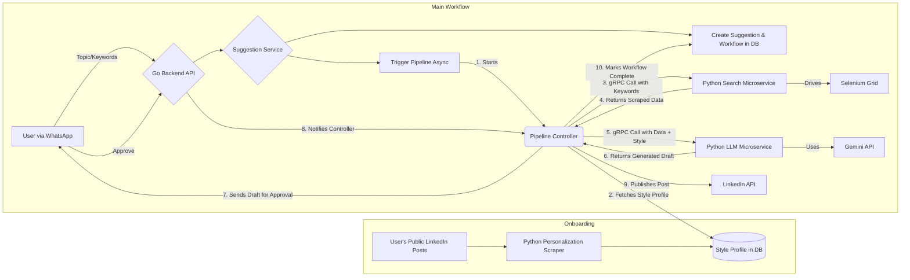

# Conversational AI Content Pipeline (WhatsApp-to-LinkedIn)

This project is a sophisticated, conversational AI pipeline that automates the creation and publishing of personalized LinkedIn content, all managed through **WhatsApp**. Users interact with a bot to provide post ideas, receive AI-generated drafts that mimic their unique writing style, and approve them for publishing without ever leaving their chat app. A companion web dashboard provides analytics and manages account connections.

## Overview

The core of this project is a robust, asynchronous backend system designed to serve a conversational user experience. The entire content creation lifecycle, from idea to published post, is handled through a simple WhatsApp chat interface.

**The User Workflow:**
1.  **Onboarding:** A user connects their LinkedIn account via a simple, one-time setup on the web admin panel. The system then scrapes their public post history to learn their unique writing style.
2.  **Ideation:** The user sends a topic or a brief description for a new post to the WhatsApp bot (e.g., "write about the latest trends in AI and machine learning").
3.  **Automated Creation:** This triggers a powerful backend pipeline that researches the topic in real-time, generates a draft using Google's Gemini LLM (infused with the user's learned writing style), and prepares it.
4.  **In-Chat Approval:** The formatted post is sent back to the user on WhatsApp for their review. They can approve or reject it with a simple reply.
5.  **Publishing:** Upon approval, the post is automatically published to their LinkedIn profile.

## Features

-   **Conversational Interface**: All primary interactions are handled via a WhatsApp bot.
-   **Personalized AI Writing Style**: The system learns from a user's past posts to mimic their tone, vocabulary, and formatting.
-   **In-Chat Approval Workflow**: Users can approve, reject, or request edits without leaving WhatsApp.
-   **Scheduled Content Delivery**: Generated posts are sent to the user for approval based on their preferred schedule (e.g., daily, weekly).
-   **Web Dashboard**: A web panel for initial LinkedIn OAuth connection, monitoring post history, viewing analytics, and managing upcoming scheduled content.
-   **Asynchronous & Stateful Pipeline**: The backend is non-blocking and tracks the state of every content job, ensuring reliability and the ability to recover from failures.

## Architecture Deep Dive

The system is built on a microservice architecture, orchestrated by a central pipeline controller written in Go. This design leverages the best technologies for each specific task.

### System Flow Diagram


### Why This Architecture is Effective

This architecture was chosen to be robust, scalable, and maintainable, reflecting modern backend design principles.

-   **Polyglot Approach (The Right Tool for the Job):** It leverages the strengths of different languages: **Go** for its high-performance concurrency and robust orchestration, and **Python** for its mature ecosystem for Data Science, Web Scraping (Selenium), and AI (Gemini SDK).
-   **Scalability & Separation of Concerns:** The microservice design allows each component to be scaled independently. If web scraping becomes a bottleneck, we can simply scale up the `chrome-node` containers without touching the rest of the application.
-   **Reliability & Resilience:** By persisting the state of the pipeline to PostgreSQL after every step, the system is resilient to crashes. A failed workflow can be inspected and retried from the exact point of failure.
-   **Maintainability & Extensibility:** The pipeline is built on an interface (`PipelineStep`). Adding new capabilities (e.g., an "Image Generation Step") is straightforward, requiring minimal changes to the core orchestrator.
-   **Superior User Experience:** The asynchronous design ensures the user interface (WhatsApp) is always fast and responsive, never waiting for long-running tasks like scraping or content generation to complete.

## Technology Stack

-   **Backend Orchestrator**: Go
    -   **Web Framework**: Gin
    -   **ORM**: GORM
-   **Microservices**: Python
-   **Inter-service Communication**: gRPC with Protocol Buffers
-   **Web Scraping**: Selenium Grid, BeautifulSoup4
-   **AI**: Google Gemini API
-   **Database**: PostgreSQL
-   **Conversational Interface**: WhatsApp API (e.g., via Twilio)
-   **Containerization**: Docker & Docker Compose

## Getting Started

### Prerequisites

-   Docker and Docker Compose
-   Go (v1.23+)
-   Python (v3.9+)
-   `protoc` Compiler and Go gRPC plugins

### Setup & Installation

1.  **Clone the repository:**
    ```bash
    git clone (https://github.com/mehulambastha/wrink-ai)
    cd wrink-ai
    ```

2.  **Generate gRPC Stubs:**
    From the project root directory, run the `protoc` command to generate the Go and Python code from the `.proto` definitions.
    ```bash
    protoc --proto_path=proto \
      --go_out=backend --go_opt=module=[github.com/mehulambastha/wrink-ai/backend](https://github.com/mehulambastha/wrink-ai/backend) \
      --go-grpc_out=backend --go-grpc_opt=module=[github.com/mehulambastha/wrink-ai/backend](https://github.com/mehulambastha/wrink-ai/backend) \
      --python_out=microservice --grpc_python_out=microservice \
      proto/search.proto
    ```

3.  **Run the Application:**
    This single command will build all images, create the custom network, and start all services.
    ```bash
    docker-compose up --build
    ```
    The Go API will be available at `http://localhost:5000`.

## Project Roadmap

-   [x] **Phase 1: Core Pipeline**
    -   [x] Build Go pipeline controller & async execution
    -   [x] Implement stateful database tracking
    -   [x] Implement gRPC communication with Python scraper
-   [ ] **Phase 2: Core Features**
    -   [x] Implement Python LLM microservice with Gemini
    -   [ ] Implement Python personalization scraper
    -   [ ] Integrate WhatsApp API for conversational flow
-   [x] **Phase 3: Web Dashboard**
    -   [x] Build user onboarding flow with LinkedIn OAuth
    -   [x] Create dashboard for viewing post history and analytics
